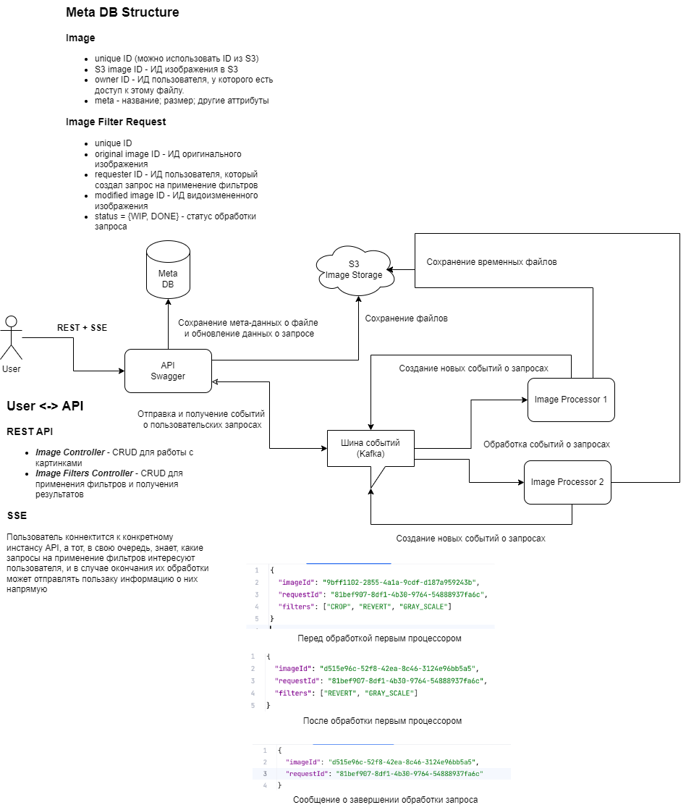

# ImageEditor

Проект реализован в рамках академии бэкенда Tinkoff. Представляет собой сервис хранения и редактирования изображений.

## Stack

- Java 17
- Spring Boot 3.2.4
- Spring Data
- Spring Security
- Swagger
- DB:
  - PostgreSQL
  - Liquibase
- Minio
- Kafka
- Testing:
  - JUnit
  - Mockito
  - TestContainers

## Architecture

## How to run

1. Run `docker compose up -d` to start dependencies (Database, Kafka, MinIO) in Docker environment
2. Run **ImageEditorAPI** module, at this point you will be able to upload images to the service
3. Run **ImageProcessor** module (multiple instances can be run), this will allow you to apply filters to uploaded images
